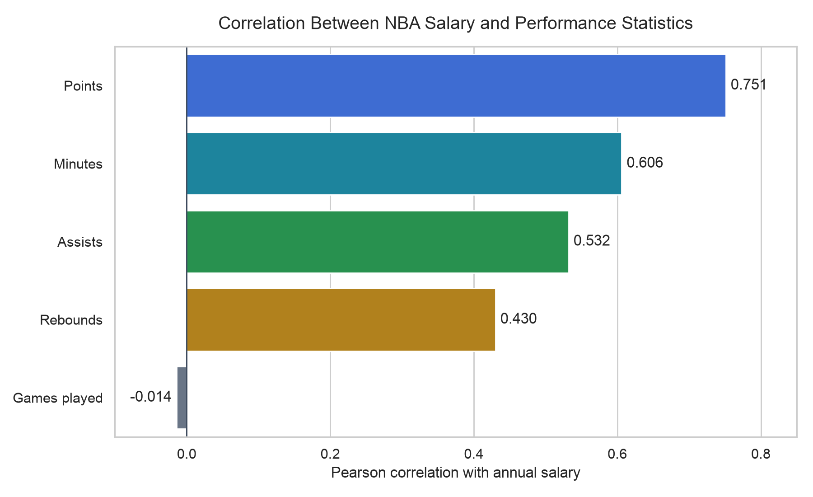
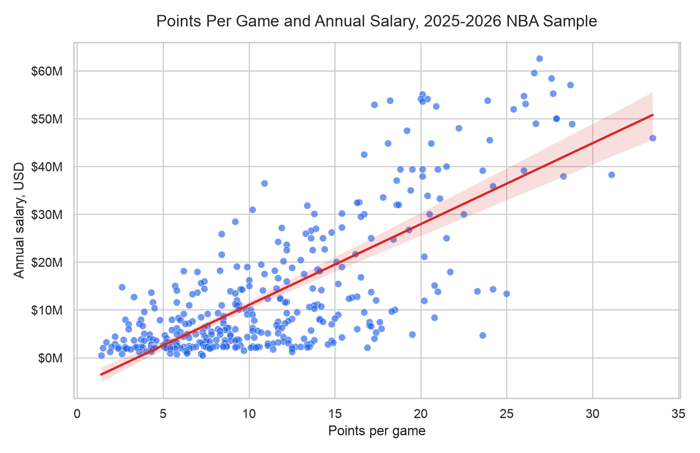

# Projects

## NBA Salary and Performance Analysis

This project studies the relationship between NBA player salaries and regular season performance statistics. The analysis uses a cleaned sample of 369 players from the 2025-2026 regular season and compares salary with points, assists, rebounds, minutes played, and games played.

**Project files**

- [Cleaned CSV](projects/nba-salary-performance/data/nba_salary_performance_analysis.csv)
- [Sanitized Jupyter Notebook](projects/nba-salary-performance/nba_salary_analysis.ipynb)
- [Additional performance visualization](projects/nba-salary-performance/images/all_performance_salary_relationships.png)
- [nba_api documentation](https://github.com/swar/nba_api/tree/master/docs)
- [Sportradar NBA API documentation](https://developer.sportradar.com/basketball/reference/nba-overview)

###  Problem Definition

NBA player salaries vary widely across the league. Some players earn maximum-level contracts, while others earn smaller contracts even when they contribute meaningful production. The problem this project examines is whether basic box score performance statistics help explain differences in current annual player salary.

The project focuses on association, not causation. A strong relationship between a statistic and salary does not prove that the statistic directly causes salary to increase.

###  Research Question

Which NBA player performance statistics - points, assists, rebounds, minutes played, or games played during the 2025-2026 regular season - are most strongly associated with the player's current annual salary?

###  Context and Relevance

This question matters because salary is one way teams communicate player value, but salary is shaped by more than current production. Current salary may reflect earlier performance, contract timing, rookie contracts, maximum salary rules, injuries, experience, defense, team needs, leadership, and market value.

For fans, analysts, and students of sports analytics, this project shows how data can reveal patterns while also showing the limits of simple statistical comparisons.

###  Data Description

The unit of analysis is one NBA player. The cleaned dataset combines one row of player performance statistics with one row of salary information for the same player.

The performance dataset came from `nba_api`, which returned 582 performance records from the 2025-2026 regular season. The salary dataset came from Sportradar, which returned 568 salary records. After matching the two datasets with official NBA player IDs, 476 player IDs matched across the two sources. Of those matched players, 391 had reported salaries and 85 had missing salaries. After excluding players with missing salaries and players with fewer than 20 games played, the final analysis contained 369 players.

The APIs were accessed at different times, so the two sources may not represent the exact same roster snapshot. This matters because NBA rosters change during the season through injuries, signings, releases, trades, and two-way contract movement.

The key fields are:

- `PLAYER_ID` and `NBA_PLAYER_ID`: official player identifiers used to match records.
- `PLAYER_NAME`: player name for readability.
- `PERFORMANCE_TEAM`: team listed in the performance data.
- `SALARY_TEAM`: team listed in the salary data.
- `AGE`, `POSITION`, and `EXPERIENCE`: descriptive player characteristics.
- `SALARY`: current annual player salary in U.S. dollars.
- `PTS`: points per game.
- `AST`: assists per game.
- `REB`: rebounds per game.
- `MIN`: minutes played per game.
- `GP`: games played.

###  Variable Conceptualization and Operationalization

The main concept is player performance. In this project, performance is operationalized through five measurable statistics: points, assists, rebounds, minutes played, and games played.

The outcome variable is current annual salary. Salary is treated as a numeric measure of compensation, but it is not a perfect measure of player value because contracts are negotiated under league rules and over multiple seasons.

###  Data Collection

Performance data was collected using `nba_api`. Salary data was collected from NBA salary records and team/player salary information. Sportradar API access was used during data collection work in the notebook.

The notebook included API usage during development, so the portfolio copy has been sanitized. The hardcoded Sportradar API key was removed, notebook outputs were cleared, and the copied notebook now uses an environment variable or secure `getpass` input.

###  Data Cleaning and Preparation

The salary and performance datasets were merged using official NBA player IDs instead of player names. This was important because names can be formatted differently across sources, and multiple players can have similar names. Player IDs provided a more reliable match key.

Duplicate API records were removed before analysis so that one player would not be counted multiple times. I used an inner join, which kept only players who appeared in both the performance dataset and the salary dataset. This made the final analysis cleaner, but it also meant that players appearing in only one source were excluded.

Players without reported salaries were excluded because salary was the outcome variable. I also required players to have played at least 20 games so that per-game statistics would be more stable. This improves comparability because a player with only a few games can have unusual averages, but it creates a trade-off: short-term players, injured players, two-way players, recently signed players, and players with limited opportunities may be left out. That exclusion may introduce selection bias because the final sample is more likely to represent players with stable roster spots and enough playing time.

Salary was converted to millions of dollars in the notebook visualizations to make charts and regression output easier to read. The cleaned CSV keeps current team and performance-season team as separate fields because players may change teams, and salary records and performance records may not come from the same moment in the season.

The cleaned CSV is included here:

[projects/nba-salary-performance/data/nba_salary_performance_analysis.csv](projects/nba-salary-performance/data/nba_salary_performance_analysis.csv)

###  Visualizations and Insights

The correlation chart shows that points per game had the strongest relationship with salary among the selected statistics. Minutes, assists, and rebounds also had positive relationships with salary. Games played had almost no relationship in the final analysis.

The scatterplot below focuses on points per game and salary. The upward trend shows that higher-scoring players generally had higher salaries, although there is still a wide spread because salary is influenced by many basketball and contract factors.

###  Correlation Results

The verified correlation results were:

- Points correlation with salary: 0.751
- Minutes correlation with salary: 0.606
- Assists correlation with salary: 0.532
- Rebounds correlation with salary: 0.430
- Games played correlation with salary: -0.014

These results suggest that scoring had the strongest simple association with salary in this sample.

### 10. Multiple Regression Results

A multiple regression model was used to evaluate the selected performance statistics together. The verified standardized regression coefficient for points was 0.802, and the model R-squared was 0.592.

This means that, in the regression model, points had the strongest positive standardized relationship with salary among the included variables. The R-squared value indicates that the model explained about 59.2 percent of the variation in salary within the analysis sample.

###  Storytelling and Conclusions

The main story from this analysis is that scoring appears to be the clearest statistical signal connected to salary. Players who score more points per game tend to earn more, and points remained the strongest variable in the regression model.

However, salary is not determined by points alone. NBA contracts are shaped by timing, league rules, prior seasons, player age, injuries, role, defensive value, team needs, leadership, and market demand. A player may be underpaid or overpaid relative to current box score production because salary often reflects expectations and negotiation context, not only present-season performance.

###  Limitations, Ethics, and Reflection

This project uses public or API-accessible basketball and salary data. Even though the data concerns public professional athletes, it is still important to avoid overclaiming what the numbers mean or reducing player value to only a few statistics.

One limitation is missing-salary selection bias. Players without reported salary values were removed, so the results describe players with available salary data rather than every player who appeared in the performance dataset. There may also be survivorship or active-roster bias in the Sportradar salary data because salary records can reflect players who were active or listed at the time the API was accessed.

The 20-game minimum also affects the sample. It makes per-game statistics more stable, but it excludes players with fewer than 20 games, including some injured players, short-term players, recently signed players, and players on less stable roster paths. This may make the analysis better for established players but weaker for understanding the full league.

Another limitation is timing. Current salary may not be based mainly on 2025-2026 performance. NBA contracts often reflect earlier performance, rookie-scale contracts, maximum salary rules, contract timing, injuries, defense, leadership, popularity, position, team needs, and market value. A player can be highly productive while still on a rookie contract, or earn a large salary because of past performance and market conditions.

The statistical results also need caution. Correlation and regression do not prove causation. Points and minutes are likely highly correlated because players who play more minutes have more opportunities to score. This relationship can affect regression results because overlapping predictors make it harder to separate the independent effect of each variable.

Responsible API use was also part of the project. API credentials should never be exposed in notebooks, repositories, screenshots, or outputs. The public notebook copy removes the hardcoded Sportradar key, clears outputs, and uses an environment variable or secure `getpass` input. API requests should follow documentation, rate limits, and terms of use.

#### Unanswered Questions

- Would previous-season performance better explain current salary?
- Do relationships differ by position or experience?
- How do rookie contracts affect the findings?
- Would advanced offensive and defensive statistics improve the model?
- How would results change using total compensation or endorsements?

## Literature Context

Earlier research on NBA pay and performance has examined whether player statistics help explain salary differences. Sigler and Sackley (2000), Simmons and Berri (2011), and Sigler and Compton (2018) each studied salary in relation to basketball performance. They did not use my 2025-2026 dataset, APIs, exact combination of variables, or regression specification. Their work provides academic context for why salary and performance is a useful question to study.

Sigler and Compton (2018) found that points, rebounds, assists, experience, and personal fouls were significant salary predictors. Their results connect closely to my findings because points had the strongest salary correlation in my analysis at approximately 0.751, followed by minutes at approximately 0.606, assists at approximately 0.532, and rebounds at approximately 0.430. Games played had almost no correlation with salary at approximately -0.014. In the multiple-regression model, the R-squared was 0.592, meaning the included performance statistics explained about 59.2 percent of the variation in salary within my final analysis sample.

The agreement between my project and earlier research supports the idea that production statistics, especially scoring, are related to salary. However, agreement between studies does not prove causation. NBA salary can also be shaped by contract rules, experience, rookie-scale contracts, previous-season performance, marketability, injuries, team needs, and the timing of contract negotiations (Sigler & Compton, 2018; Sigler & Sackley, 2000; Simmons & Berri, 2011).

### Additional Non-Peer-Reviewed Comparisons

The following sources are useful supplementary comparisons, but they should not be counted toward the three required peer-reviewed academic sources. Feng et al. (2023) is a conference-proceedings article whose peer-review status is not being relied upon for this assignment. Wu et al. (n.d.) and Carr (2025) are student or non-peer-reviewed sources.

Feng et al. (2023) used multiple regression and regularized regression approaches to study NBA salary prediction. Wu et al. (n.d.) used player statistics for salary classification and found that points and defensive rebounds were useful for classifying salary groups. Carr (2025) used random-forest regression and reported a test R-squared of 0.77 while discussing rookie contracts, maximum contracts, marketability, and other sources of prediction error.

These comparisons support the general relevance of asking how performance statistics relate to salary, but they are not substitutes for peer-reviewed research.

## References

Carr, E. (2025, May 5). Predicting NBA contracts using statistics. *Medium*. [https://medium.com/inst414-data-science-tech/predicting-nba-contracts-using-statistics-8842f3bd45e3](https://medium.com/inst414-data-science-tech/predicting-nba-contracts-using-statistics-8842f3bd45e3)

Feng, X., Wang, Y., & Xiong, T. (2023). NBA player salary analysis based on multivariate regression analysis. *Highlights in Science, Engineering and Technology, 49*, 157–166. [https://doi.org/10.54097/hset.v49i.8498](https://doi.org/10.54097/hset.v49i.8498)

`nba_api` documentation. (n.d.). [https://github.com/swar/nba_api/tree/master/docs](https://github.com/swar/nba_api/tree/master/docs)

Sigler, K., & Compton, W. (2018). NBA players' pay and performance: What counts? *The Sport Journal*. [https://thesportjournal.org/article/nba-players-pay-and-performance-what-counts/](https://thesportjournal.org/article/nba-players-pay-and-performance-what-counts/)

Sigler, K. J., & Sackley, W. H. (2000). NBA players: Are they paid for performance? *Managerial Finance, 26*(7), 46–51. [https://doi.org/10.1108/03074350010766783](https://doi.org/10.1108/03074350010766783)

Simmons, R., & Berri, D. J. (2011). Mixing the princes and the paupers: Pay and performance in the National Basketball Association. *Labour Economics, 18*(3), 381–388. [https://doi.org/10.1016/j.labeco.2010.11.012](https://doi.org/10.1016/j.labeco.2010.11.012)

Sportradar NBA API documentation. (n.d.). [https://developer.sportradar.com/basketball/reference/nba-overview](https://developer.sportradar.com/basketball/reference/nba-overview)

Wu, W., Feng, K., Li, R., Sengupta, K., & Cheng, A. (n.d.). *Classification of NBA salaries through player statistics*. Sports Analytics Group at Berkeley. [https://sportsanalytics.studentorg.berkeley.edu/projects/nba-salaries-stats.pdf](https://sportsanalytics.studentorg.berkeley.edu/projects/nba-salaries-stats.pdf)
