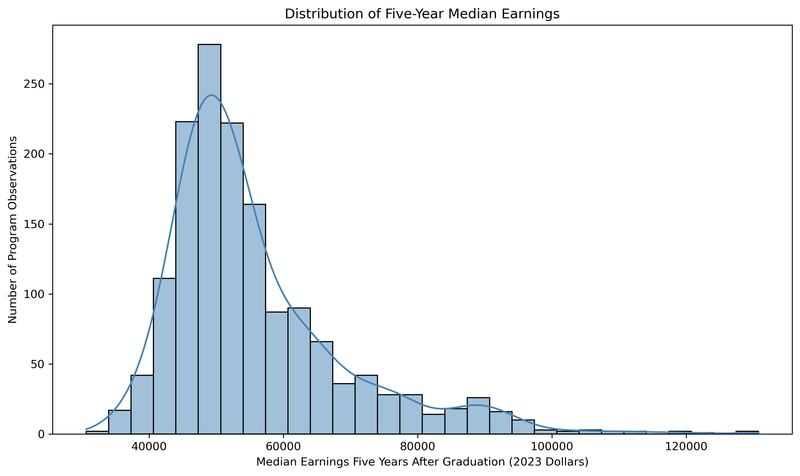
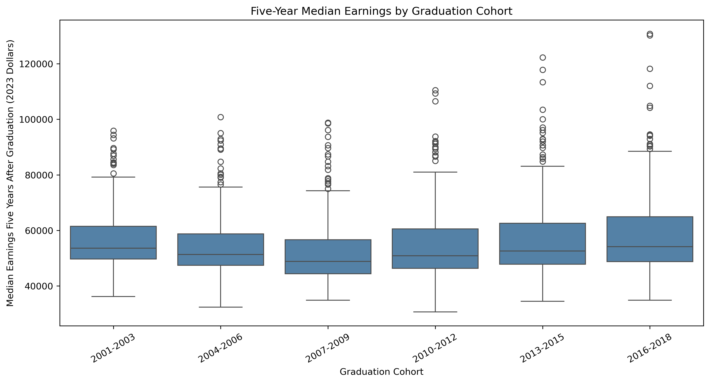
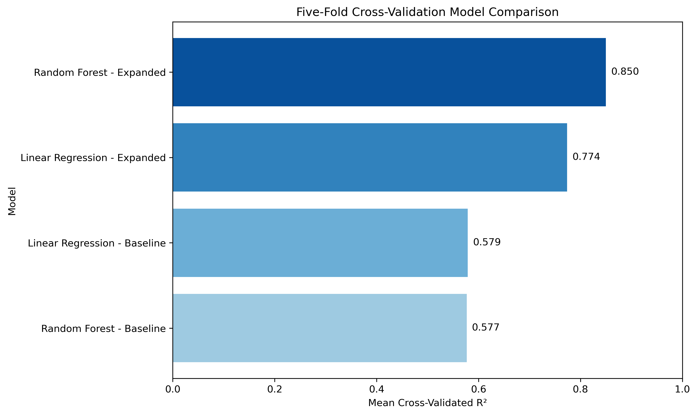
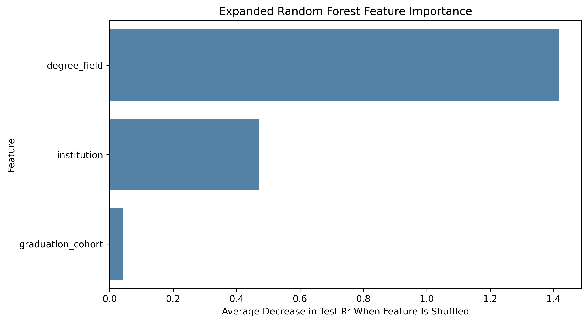
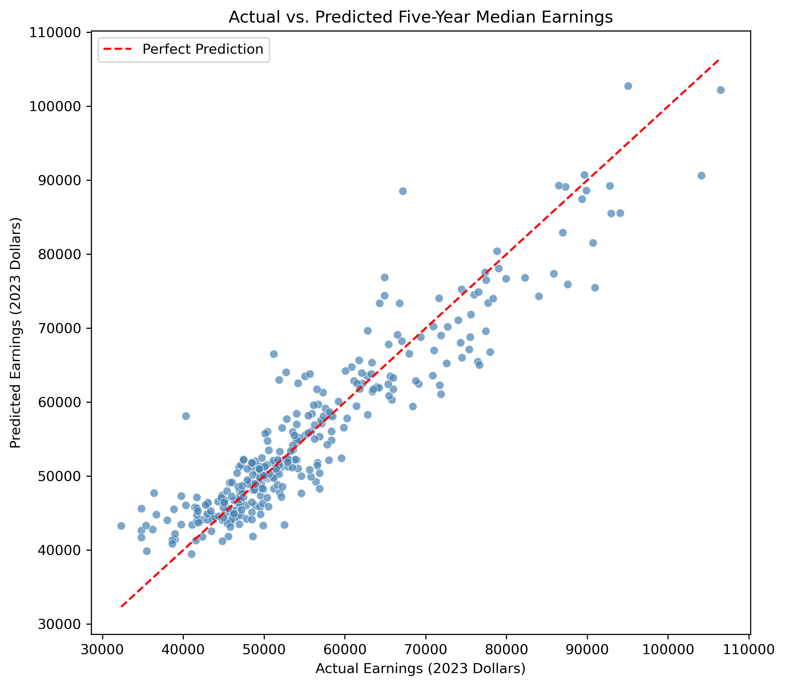

[Home](../../index.html) · [All projects](../../project.html)

# Project Two: Predicting North Carolina Graduate Earnings

**DTSC-2301 · Supervised machine learning · Parsa Feizi**

Knowing a graduate's degree field provides a useful starting point for predicting program-level earnings. Adding the institution and graduation cohort improves those predictions substantially. The best model, an expanded random forest, achieves a mean cross-validation R² of **0.850**, with an average absolute error of **$3,553** for program median earnings.

These results describe groups of graduates. They do not predict an individual student's salary or establish that attending a particular institution causes higher earnings.

**Explore the work:** [Jupyter notebook on GitHub](https://github.com/parsafeizi/Data-Scince-Portfolio/blob/main/projects/nc-graduate-earnings/nc_graduate_earnings_analysis.ipynb) · [Cleaned data](data/nc_graduate_earnings_clean.csv) · [Cross-validation results](data/cross_validation_model_results.csv)

## Problem Definition

**Research question:** How much does adding institution and graduation cohort improve predictions of median earnings five years after graduation for bachelor's degree programs at participating North Carolina institutions?

This is a **supervised regression problem**: the models learn from observations with a known numeric outcome. The target, `median_earnings_5yr`, is **median annual earnings in the fifth year after graduation, measured in 2023 dollars**. It is not the sum of earnings over five years.

For each of two methods—multiple linear regression and random forest regression—I compare a degree-field-only baseline with an expanded model that also includes institution and graduation cohort. This comparison isolates the predictive improvement from adding those two features together.

## Background and Context

Students and families often consider earnings when comparing educational options. Program-level data can provide context, but interpreting those data responsibly requires attention to who is represented and what the numbers can explain.

Carnevale, Cheah, and Hanson (2015) document substantial differences in earnings across college majors, supporting degree field as the baseline predictor. Their national study covers a different population and time frame, so its dollar values are not directly comparable with this project's five-year outcomes. [Georgetown University report](https://cew.georgetown.edu/cew-reports/valueofcollegemajors/).

Chetty et al. (2020) examine differences across colleges in students' earnings and parental income. Their findings motivate considering institution while recognizing that institutional differences can reflect student backgrounds and selection. This project does not reproduce their causal analysis. [Peer-reviewed study](https://academic.oup.com/qje/article/135/3/1567/5741707).

The Census Bureau's Post-Secondary Employment Outcomes (PSEO) data connect participating institutions' graduate records with employment records. They offer a public source for studying earnings by field, institution, and cohort. [PSEO methodology](https://lehd.ces.census.gov/data/pseo_documentation.html).

## Data Description

The saved [North Carolina PSEO workbook](data/pseo_nc.xlsx) identifies itself as **release 2026Q2, data schema V4.14.1**. The analysis uses its `Earnings` sheet, which contains 16,348 rows before filtering. The original download date was not recorded; the included workbook preserves the exact source snapshot used here.

Each retained row represents an **aggregated degree-field, institution, and graduation-cohort observation—not an individual graduate**. Fields are broad two-digit Classification of Instructional Programs (CIP) categories, rather than individual narrow majors.

| Dataset characteristic | Retained sample |
| --- | ---: |
| Program observations | 1,537 |
| Degree fields | 29 |
| Participating institutions | 16 |
| Graduation cohorts | 6 |
| Missing values in retained columns | 0 |
| Duplicate field–institution–cohort combinations | 0 |

The cohorts are 2001–2003, 2004–2006, 2007–2009, 2010–2012, 2013–2015, and 2016–2018.

| Variable | Meaning and use |
| --- | --- |
| `degree_field` | Broad subject area; baseline and expanded predictor |
| `institution` | Participating institution; expanded predictor |
| `graduation_cohort` | Three-year graduation group; expanded predictor |
| `median_earnings_5yr` | Five-year median annual earnings; prediction target |
| `graduate_count_5yr` | Published earnings-population count; retained for context only |

PSEO earnings describe graduates meeting labor-force attachment criteria, not all graduates. The Census methodology excludes earnings below its annual threshold and workers with two or more quarters without earnings. It reports inflation-adjusted earnings in 2023 dollars. [Census earnings definitions](https://lehd.ces.census.gov/data/pseo_documentation.html#earnings).

## Data Understanding and Exploration

The median program observation has earnings of **$51,975**. The middle half range from **$47,119 to $60,837**, and the full range is **$30,647 to $130,776**. Each program observation receives equal weight; these summaries are not a graduate-weighted statewide median.

**Interpretation:** Earnings are right-skewed. Most observations cluster well below the highest program medians. The upper tail makes it useful to evaluate both typical dollar error and a metric that penalizes large errors more strongly. High-earning observations are retained because a large value alone does not establish a data error.

**Interpretation:** The median declines through the 2007–2009 cohort and rises in later cohorts. The boxes overlap considerably, showing that cohort alone cannot explain the variation. These descriptive differences do not establish the cause of the pattern.

Coverage is uneven: individual degree fields have **1–91 observations**, and institutions have **6–139**. Predictions for rare categories may therefore be less reliable. This is regression, so class imbalance is not applicable; sparse categories and rare high-earnings outcomes are the relevant concerns.

## Data Preparation and Feature Selection

The notebook applies the following steps to the saved workbook:

1. Keep bachelor's degrees, two-digit CIP fields, individual institutions, and named graduation cohorts. Exclude statewide totals, all-field totals, and “All Cohorts” rows to avoid mixing overlapping aggregation levels.
2. Convert earnings and graduate counts to numeric values. Of **2,203 candidate rows**, **666** have unavailable or suppressed five-year earnings and are excluded. The code does not distinguish every reason for unavailability. Missing targets are not imputed because that would invent outcomes for training and evaluation.
3. Remove line breaks from categorical labels, reset the index, and verify missing values, duplicate keys, and category counts.
4. Rename the five retained columns and export the cleaned CSV.
5. One-hot encode the predictors inside a scikit-learn pipeline. This creates binary indicators without assuming an order among fields, institutions, or cohorts. The encoder learns categories from training data only, including within each validation fold.

Degree field is selected because it describes the area of training and provides the requested baseline. Institution and cohort test whether school context and graduation timing add predictive information. Graduate count is neither a predictor nor a sample weight: the analysis compares program observations equally. Other earnings measures are excluded from the predictors.

No scaling or target transformation is applied. Binary indicators do not require rescaling for these models, and tree splits do not require standardized inputs. The encoder ignores unknown categories so prediction can proceed, but this does not validate predictions for completely new institutions.

## Baseline and Model Development

| Method | Baseline predictors | Expanded predictors | Modeling choice |
| --- | --- | --- | --- |
| Multiple linear regression | Degree field | Field, institution, cohort | Additive differences between categories |
| Random forest regression | Degree field | Field, institution, cohort | 500 trees; minimum 2 observations per leaf; seed 42 |

The degree-field-only models establish the reference for the research question. The expanded models test the value of additional information. Linear regression offers a simple additive model, while random forest can capture nonlinear relationships and interactions. No hyperparameter search was performed; the original model settings are preserved.

### Training and Testing Strategy

An initial 80/20 split yields **1,229 training observations and 308 test observations**, using seed 42 and stratification by cohort. All four models use the same split. The initial test set supports the prediction plot and feature-importance analysis below.

The primary comparison uses **five-fold cross-validation on all 1,537 observations**, with shuffled folds and seed 42. Each model trains on four folds and is evaluated on the remaining fold, repeating until every row has been evaluated once. Encoding is refitted inside each training fold, and the column transformer selects only the specified predictors, preventing the target and graduate count from entering the model.

Cross-validation provides a comparison across several splits rather than relying on one split. However, many institutions appear in both training and validation data. Also, the initial test rows participate in the later full-data cross-validation, so that test set is **not an untouched final audit** after model selection. This design evaluates additional observations within the represented setting, not performance at new institutions or on future cohorts.

## Model Evaluation and Selection

Three complementary metrics evaluate this regression task:

- **R²:** explained variation relative to a mean-only reference. Higher is better; R² can be negative. It is not “accuracy” or the percentage of graduates whose earnings were predicted correctly.
- **Mean absolute error (MAE):** average absolute prediction error in dollars. Lower is better and easier to interpret as a typical error size across program observations.
- **Root mean squared error (RMSE):** another dollar-error measure that gives more weight to large errors. Lower is better.

The confirmed results are means of the five held-out fold scores, rounded for presentation:

| Model | Mean R² | Mean MAE | Mean RMSE |
| --- | ---: | ---: | ---: |
| Linear regression — baseline | 0.579 | $6,075 | $8,701 |
| Linear regression — expanded | 0.774 | $4,426 | $6,379 |
| Random forest — baseline | 0.577 | $6,073 | $8,715 |
| **Random forest — expanded** | **0.850** | **$3,553** | **$5,198** |

**Interpretation:** Adding institution and cohort improves mean R² by **0.195** for linear regression and **0.273** for random forest. Random forest MAE falls by approximately **$2,520, or 41.5%**. Institution and cohort therefore provide substantial predictive information beyond degree field alone. These are descriptive improvements; no significance test was conducted.

The **expanded random forest is the final selected model** because it has the highest mean R² and the lowest MAE and RMSE. Its mean R² corresponds to about **85.0% explained variation across validation folds**. The R² standard deviation across folds is 0.013; this describes variability across those folds, not a confidence interval or individual prediction guarantee.

## Model Interpretation and Insights

Permutation importance tests how much prediction quality falls when one feature is shuffled. For the expanded random forest fitted on the initial training subset, each original feature is shuffled 20 times in the test subset, and the average decrease in test R² is recorded.

**Interpretation:** Degree field has the largest importance, with an average R² decrease of **1.417** when shuffled. Institution is meaningful at **0.471**, while cohort has a smaller individual importance of **0.041**. These are changes in R², not percentages or additive shares of earnings. Importance can exceed 1 because shuffling can make predictions worse than a mean-only reference, producing negative R². The measures describe model reliance, not causal effects.

**Interpretation:** Points close to the diagonal have smaller errors. Some of the highest-earning observations fall below the line, indicating underprediction in the upper tail. This plot uses the initial test subset, not cross-validation predictions. On that split, the model has R² of 0.874, MAE of about $3,402, and RMSE of about $4,747; the five-fold results above remain the primary comparison.

The practical insight is that knowing the degree field provides a useful start, and institution adds substantial context. Cohort contributes less individually, even though including institution and cohort together clearly improves both models. These comparisons do not isolate the causal effect of either added feature.

## Limitations, Ethics, and Reflection

- **Coverage and selection bias:** PSEO includes participating institutions and may not represent every North Carolina institution. Excluding missing or suppressed outcomes may favor better-represented programs. Sparse categories have limited evidence for evaluation.
- **Aggregate outcomes:** Program medians cannot predict an individual student's earnings. They also conceal variation among graduates within the same program and cohort.
- **Omitted factors:** Occupation, industry, location, experience, demographics, and student background are not included. Institution may partly reflect these differences. Predictive associations do not prove that attending a particular institution causes higher earnings.
- **Validation limits:** Random cross-validation shares many institutions across folds, potentially overstating performance for unseen institutions. Categorical cohort encoding does not establish the ability to forecast future cohorts. Model selection and interpretation also reuse available evaluation data.
- **Measurement and privacy:** PSEO applies confidentiality protections, including noise and suppression. Released aggregates should not be treated as exact individual records or used to attempt re-identification. [Census protection methodology](https://lehd.ces.census.gov/data/pseo_documentation.html#protection-system).
- **Consequences of mistakes:** Incorrect predictions could mislead students selecting a program or institution. This model should be an exploratory tool, not the sole basis for educational or financial decisions. Cost, completion prospects, interests, job quality, and education's broader value also matter.

This project shows why a strong evaluation score still needs a clearly defined scope. The next steps would be holding out entire institutions, testing later cohorts chronologically, and comparing errors for sparse fields and high-earning programs. Those would provide additional evidence; they are not completed analyses in this project.

## Code and Transparency

The [complete Jupyter notebook on GitHub](https://github.com/parsafeizi/Data-Scince-Portfolio/blob/main/projects/nc-graduate-earnings/nc_graduate_earnings_analysis.ipynb) contains the preparation, exploration, model fitting, evaluation, and interpretation code with executed outputs.

Reproducibility files are available here:

- [Original PSEO workbook](data/pseo_nc.xlsx)
- [Cleaned dataset](data/nc_graduate_earnings_clean.csv)
- [Five-fold model results](data/cross_validation_model_results.csv)
- [Initial test-set results](data/test_set_model_results.csv)
- [Permutation importance results](data/random_forest_feature_importance.csv)
- [Python requirements](requirements.txt)

Use Python 3.13.5 and install the listed dependencies, then open the notebook from this project folder or the repository root and run all cells in order. The analysis uses the saved workbook without credentials or a live data download. Running the notebook regenerates the cleaned CSV, five figures, and result tables. Cross-validation runs sequentially to avoid multiprocessing shutdown errors; the folds, seeds, and model settings are unchanged.

### AI Usage Disclosure

I used **OpenAI ChatGPT** to assist with brainstorming, code troubleshooting, explaining Python and scikit-learn methods, organizing the analysis, and improving writing. I reviewed the code and outputs and remain responsible for the analysis.

## References

Carnevale, A. P., Cheah, B., & Hanson, A. R. (2015). *The economic value of college majors*. Georgetown University Center on Education and the Workforce. [Report and supporting materials](https://cew.georgetown.edu/cew-reports/valueofcollegemajors/).

Chetty, R., Friedman, J. N., Saez, E., Turner, N., & Yagan, D. (2020). Income segregation and intergenerational mobility across colleges in the United States. *The Quarterly Journal of Economics, 135*(3), 1567–1633. [https://doi.org/10.1093/qje/qjaa005](https://doi.org/10.1093/qje/qjaa005).

U.S. Census Bureau. (n.d.). *Post-Secondary Employment Outcomes (PSEO) help and documentation*. Retrieved October 3, 2026, from [PSEO documentation](https://lehd.ces.census.gov/data/pseo_documentation.html).

---

[Back to all projects](../../project.html) · [Back to portfolio home](../../index.html)
